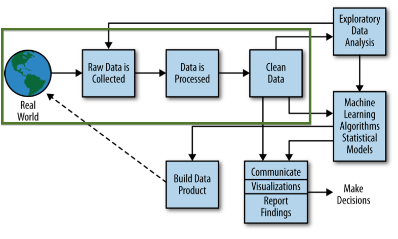

GCSE and equivalent attainment by pupil characteristics: 2012 to 2013
=====================================================================

##Introduction
This is an exercise in collecting, pre-processing and cleansing an open data dataset on education made available by the UK government's Department for Education (DfE). 

Our objective is to cover the early stages - marked by the green frame - of a typical data science analysis project, as shown in the diagram below (from ["Doing Data Science"](http://shop.oreilly.com/product/0636920028529.do) by Cathy O'Neil and Rachel Schutt, O'Reilly 2013). 

The original dataset was published at [https://www.gov.uk/government/publications/gcse-and-equivalent-attainment-by-pupil-characteristics-2012-to-2013](https://www.gov.uk/government/publications/gcse-and-equivalent-attainment-by-pupil-characteristics-2012-to-2013). The data was downloaded on 25th January 2014.

##Folders description
Below is a description of the contents in this project, by folder.
- *data*
    - *raw*: the source publication webpage, dataset and documentation as found at the source web address
    - *preprocessed*: selected datasets from the 'raw' folder, cleansed and homogenised according to data science best practices

##Process
The detailed process is described in [process.md](process.md).

##Licence
 The source data was made available by the DfE under the [Open Government Licence v2.0](http://www.nationalarchives.gov.uk/doc/open-government-licence/version/2).

 All subsequent work is licensed under a [Creative Commons Attribution 4.0 International License](http://creativecommons.org/licenses/by/4.0/).